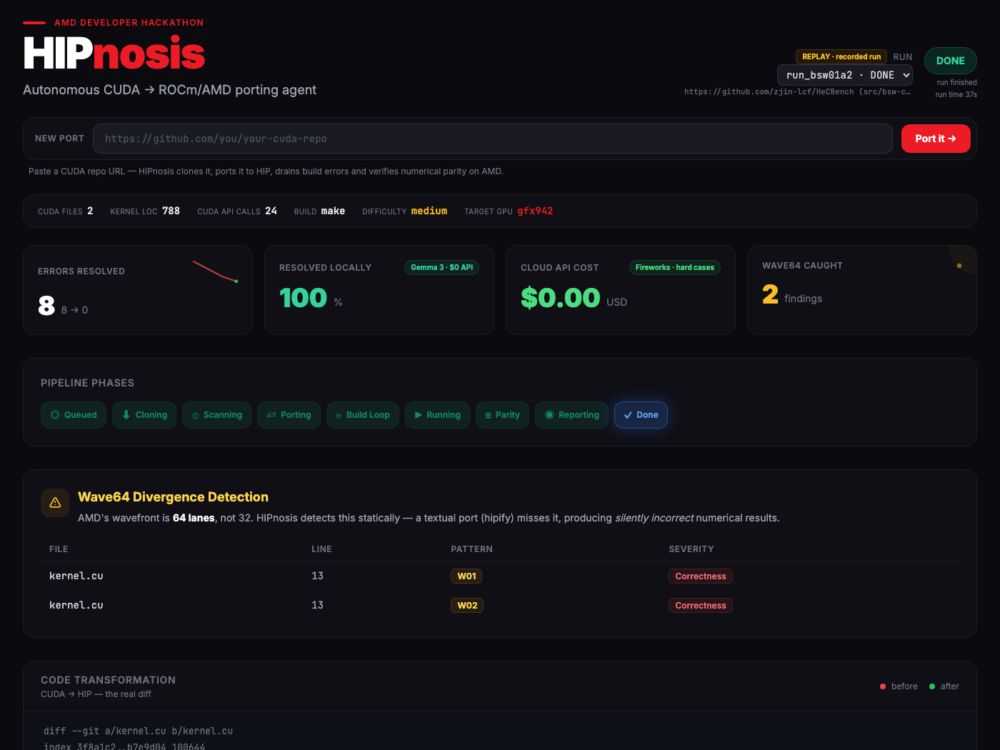

<div align="center">

# ⚡ HIPnosis

### The CUDA → ROCm port that comes with receipts.

**Paste a CUDA repo URL. Get back a verified, compiled, numerically-checked ROCm port — with a certificate to prove it.**

[](orchestrator/tests)
[](https://www.amd.com/en/products/software/rocm.html)
[](https://huggingface.co/google/gemma-3-27b-it)
[](LICENSE)
[](https://lablab.ai)

[Quickstart](#-quickstart-no-gpu-required) · [How it works](#-how-it-works) · [Why it's different](#-why-hipnosis-wins-where-others-stop) · [The wave64 story](#-the-bug-nobody-else-catches) · [Architecture](#-architecture)



*The full pipeline, live (synthetic demo replay): 8 compiler errors drained to 0, 100% fixed locally, and 2 silent correctness bugs flagged that a textual translation would have shipped. Real-silicon MI300X artifacts land with our M0 run — see roadmap.*

</div>

---

## The problem

There are **billions of dollars of CUDA code** locked to one vendor's hardware. AMD's MI300X offers 192 GB of HBM3 — 2.4× an H100 — at a fraction of the cost, but the migration path is where teams give up:

- `hipify` translates ~85% of the syntax and **stops exactly where the problems begin**: the port doesn't compile, nobody fixes it, nobody proves it still computes the same numbers.
- Emulation layers and closed compilers keep your code *being CUDA* — you never actually cross the border.
- Manual porting works. It also takes an engineer-month per repo.

**HIPnosis crosses the border once, with papers.** The output is native ROCm code that *you own* — no runtime shim, no compiler lock-in, no LLM hallucinations shipped to production.

## 🚀 Quickstart (no GPU required)

The full experience — a Smith-Waterman CUDA port replayed live through the entire pipeline (synthetic demo fixtures; the recorded MI300X trace replaces them after our first silicon run) — runs on any laptop:

```bash
git clone https://github.com/manuelpenazuniga/HIPnosis.git
cd HIPnosis
docker compose --profile replay up
# open http://localhost:8080
```

Have an AMD GPU? Run the real thing:

```bash
cp orchestrator/.env.example orchestrator/.env   # add your HF_TOKEN (Gemma is gated)
docker compose --profile gpu up -d --build
# paste one of the curated demo CUDA repos into the dashboard, or:
curl -X POST http://localhost:8080/runs \
  -H 'Content-Type: application/json' \
  -d '{"repo_url": "https://github.com/zjin-lcf/HeCBench"}'
```

> **Note on scope:** runs are currently limited to curated demo repositories — executing an arbitrary repo's Makefile safely requires sandboxing that is on the roadmap, not faked.

## ⚙️ How it works

```
 URL ──▶ SCAN ──▶ PORT ──▶ BUILD LOOP ──▶ VERIFY ──▶ SHIP
         │        │           │             │          │
         │        │           │             │          └─ branch/PR + Port Certificate
         │        │           │             └─ runs the binary, checks numerical
         │        │           │                parity vs reference (rtol/atol)
         │        │           └─ compile → parse errors → classify → patch →
         │        │              commit → repeat, until zero errors
         │        └─ hipify + build-system adaptation (nvcc → hipcc)
         └─ inventory + static wave64 divergence audit
```

1. **Scan** — clones the repo, inventories CUDA API usage, estimates difficulty, and runs a static **wave64 audit** (see below).
2. **Port** — `hipify` translation plus Makefile adaptation. Every change is an atomic, revertible git commit.
3. **Build loop** — the heart. Compiles on real AMD silicon; a deterministic parser extracts each error, a 14-class taxonomy classifies it, and a fix is proposed — by rule table when possible, by LLM when not. Fixes apply as SEARCH/REPLACE patches with hard uniqueness validation. Loop until green, with anti-oscillation counters and honest exits.
4. **Verify** — executes the ported binary and compares outputs against the reference **numerically** (`rtol/atol`), plus timing.
5. **Ship** — a git branch/PR and `HIPNOSIS_CERTIFICATE.md`: compile ✓, tests ✓, parity ✓, what was fixed by whom, and — honestly — anything that still `NEEDS_HUMAN`.

## 🏆 Why HIPnosis wins where others stop

Every attack on the CUDA moat picks a layer of the stack — and the layer determines the outcome:

| Approach | Promise | Structural flaw |
|---|---|---|
| **ZLUDA** (binary interception) | "your binary thinks it's still on NVIDIA" | Perpetual emulation. Your code *stays* CUDA. |
| **SCALE** (closed compiler) | "keep your CUDA source, new compiler" | Swaps NVIDIA lock-in for compiler lock-in. Code *stays* CUDA. |
| **hipify** (one-shot transpile) | "I translate the mechanical 85%" | No semantics, no loop, no verification. Stops where the work starts. |
| **HIPnosis** (verified migration) | **"cross the border once, with papers"** | The output is plain ROCm code you own, proven equivalent on real hardware. |

And the trust model is different from every "AI porting" tool you've seen:

- **Oracles, not opinions.** Success is declared by the compiler, the test suite, and a numerical comparator — *never* by asking an LLM "does this look right?".
- **The LLM decides content; the orchestrator decides control.** A deterministic state machine drives everything; models are pure functions (`classify(error) → class`, `propose_fix(...) → patch`).
- **Every number is computed, never generated.** Metrics in reports and certificates come from code. LLMs cannot invent your benchmark results.
- **Append-only JSONL trace.** If it's not in the trace, it didn't happen. Every run is fully auditable and replayable.
- **Honest degradation.** What can't be fixed automatically is listed as `NEEDS_HUMAN` in the certificate — not hidden.

## 🌊 The bug nobody else catches

NVIDIA warps have **32 lanes**. AMD wavefronts have **64**. Code like this:

```cuda
unsigned mask = __ballot_sync(0xffffffff, threadIdx.x < n);  // 32-bit mask
int laneId = threadIdx.x % 32;                               // warp-size arithmetic
```

...hipifies cleanly, **compiles cleanly, and silently computes wrong numbers on AMD.** No compiler error. No crash. Just corrupted results in production.

HIPnosis ships a static analyzer with **7 wave64 divergence patterns** (W01–W07: 32-bit ballot masks, truncated popcounts, hardcoded warp widths, lane arithmetic, cooperative-group partitions...), each with a severity rating and a fixed explanation. Validated against real HeCBench kernels with **zero false positives** — every finding in the screenshot above is a genuine correctness bug that a textual port would have shipped.

This is the difference between *translating text* and *migrating semantics*.

## 💰 The cost story

HIPnosis routes intelligence in three tiers, cheapest first:

| Tier | What | Cost |
|---|---|---|
| **Deterministic** | Rule-table fixes for known error classes | $0 |
| **Local** | Gemma 3 27B on the same MI300X (vLLM, ROCm-native) | $0 API |
| **Remote** | Frontier LLM (Fireworks) — hard cases only, forced after stagnation | cents |

In the synthetic demo scenario: **100% resolved locally, $0.00 cloud spend.** The GPU that verifies your port is the GPU that thinks about your port. (Measured token accounting from real-silicon runs ships with M0 — we only publish numbers the pipeline actually computed.)

## 📊 What you get: the Port Certificate

Every run ends with a machine-generated, human-readable certificate (excerpt below from the synthetic demo scenario):

> **HIPnosis — Port Certificate**
> **Repo:** `github.com/zjin-lcf/HeCBench (src/bsw-cuda)` · **Difficulty:** medium · **Build:** make
>
> HIPnosis ported bsw-cuda (Smith-Waterman) from CUDA to ROCm/HIP autonomously: **8 compile errors resolved in 4 iterations**, 100% locally (Gemma 27B + deterministic rules, $0 API), with **2 critical wavefront-64 corrections** that a textual port would have missed. The benchmark self-check verifies **PASS** against its internal reference.

Plus: full fix ledger (which tier fixed what, at which commit), token accounting, timing, and the `NEEDS_HUMAN` section when applicable.

## 🛂 The Port Passport — provenance you can verify

The certificate is human-readable. The **Port Passport** (`HIPNOSIS_ATTESTATION.jsonl`) is *machine-verifiable* — it makes "cross the border with papers" literal.

Every run emits an in-toto/SLSA-inspired attestation with SHA-256 digests of the diff and certificate, the source and final commits, the build environment (GPU, ROCm, oracle mode), and the verdict:

```json
{
  "predicate": {
    "builder": { "id": "hipnosis://port-agent" },
    "source":  { "commit": "3f8a1c2…" },
    "port":    { "final_commit": "b7e9d04…" },
    "materials": { "diff": { "alg": "sha256", "digest": "8b3f1a9…c10401" } },
    "environment": { "gpu_arch": "gfx942", "oracle_mode": "real" },
    "result": { "verdict": "PASS", "errors_initial": 8, "errors_final": 0 },
    "provenance_level": "SLSA-L1 (unsigned): describes inputs, build and environment"
  }
}
```

The dashboard recomputes `sha256(diff)` **in your browser** and compares it to the attestation — a green **`PASSPORT VERIFIED`** badge. Flip a single byte of the port and it turns **`TAMPERED`**. No blockchain, no trust-me: the hash either matches or it doesn't. (We claim SLSA **L1** — honest provenance of inputs and build; not L2, because it isn't signed yet.)

## 🛡️ HIPnosis Guard — stay migrated

A port is step one. HIPnosis also ships **`.github/workflows/hipnosis-guard.yml`** into your PR: a static CI gate that runs the *same* wavefront-64 detector on every future change and **blocks** anyone who reintroduces CUDA or a 32-lane assumption.

```
  ✕ kernel.hip:13  [W01]           32-bit mask on a 64-lane wavefront
  ✕ kernel.hip:2   [WARP32-DEFINE] hardcoded warp size of 32
  ✕ Merge blocked: portability regressions reintroduced.
```

No GPU required — it's pure static analysis. Add `#define WARP_SIZE 32` to a ported repo, open a PR, and the check fails on the exact line. Details in [`docs/hipnosis-guard.md`](docs/hipnosis-guard.md); run it with `python -m core.guard <paths>`.

## 🏗 Architecture

```
┌────────────────────────── MI300X droplet ──────────────────────────┐
│                                                                    │
│  ┌─ orchestrator (FastAPI :8080) ─────────────┐  ┌─ vLLM :8000 ─┐  │
│  │  dashboard (static HTML+JS, 1s polling)    │  │  Gemma 3 27B │  │
│  │  deterministic FSM · build loop · oracles  │──▶  (local tier)│  │
│  │  SQLite runs · JSONL traces · git workspaces│  └──────────────┘  │
│  └────────────────────────────────────────────┘         │          │
│         │  hipcc / hipify / rocminfo (subprocess)       ▼          │
│         ▼                                        Fireworks API     │
│    real GPU compile + run + numerical parity     (remote tier)     │
└────────────────────────────────────────────────────────────────────┘
```

- **Zero build steps, zero frameworks**: the dashboard is static HTML + vanilla JS with all assets vendored — it works fully offline.
- **Three oracle modes**: `real` (GPU), `mock` (fixtures — the whole pipeline develops and tests without hardware), `replay` (recorded traces — how judges run it).
- **393 automated tests** across every layer: error parsing, patching, wave64 detection, taxonomy, parity, the loop itself.

## 🗺 Status & roadmap

- ✅ Full pipeline end-to-end (scan → port → loop → verify → certificate) — 3 fixture scenarios green in mock mode
- ✅ Wave64 static analyzer validated against real kernels (zero false positives)
- ✅ Live dashboard with honest observability (mode badges, connection state, failure causes)
- 🔜 Real-silicon M0 run on MI300X (AMD Developer Cloud) — replaces the synthetic replay with a recorded trace
- 🔜 Performance benchmarking (`rocprof`) in the certificate: "compiles" ≠ "performs"
- ✅ HIPnosis Guard — CI gate that blocks CUDA/warp32 regressions on future PRs
- 🔭 Multi-repo fleets, CMake support, performance regression thresholds

## 🙌 Built for the AMD Developer Hackathon: ACT II

HIPnosis targets **Track 3 (Unicorn)** and the **Gemma prize**: ROCm is the substrate, the MI300X is the verification oracle, and Gemma is the local brain. Built with open models, on open software, producing open code.

## License

[MIT](LICENSE) — port freely.
